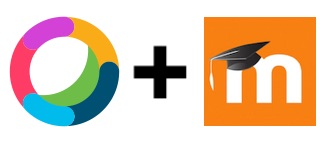

# moodle-mod_webexteams

Moodle activity plugin for linking Cisco WebEx teams before know Spark rooms to Moodle courses and course groups

## Features
- Create in the Moodle courses Cisco WebEx Teams rooms like activities. They are ideal for work or discussión  activities between course member or course group memebers using the Cisco WebEx Teams collaboration features like meetings, voice, video, filesharing and whiteboard.

- Tracking all courses collaboration activities in Moodle interface and participate in each space though indivial widget.

## Installation

1. Download the latest Cisco WebEx teams plugin.

2. In the Moodle Admin interface does the following steps.
- Click on the `Site administration` on the Left menu.
- Click on the `Plugin` menu.
- Click on the `Install plugins` option.
- Choose the option `Install plugin from ZIP file`.
- Upload the zip file using the drag and drop function or `Choose a file` button.
- Click on `Install plugin from ZIP file`
- Follow the verification steps and final installation.
- Enjoy it.

# Project resources

- [Source code](https://github.com/Edunao/moodle-mod_ciscospark)
- [Issue tracker](https://github.com/Edunao/moodle-mod_ciscospark/issues>)

# Credits

- [Original author](https://github.com/Edunao)
- [Current maintainer](https://github.com/Edunao)
- [Contributors](https://github.com/Edunao/moodle-mod_ciscospark/graphs/contributors)